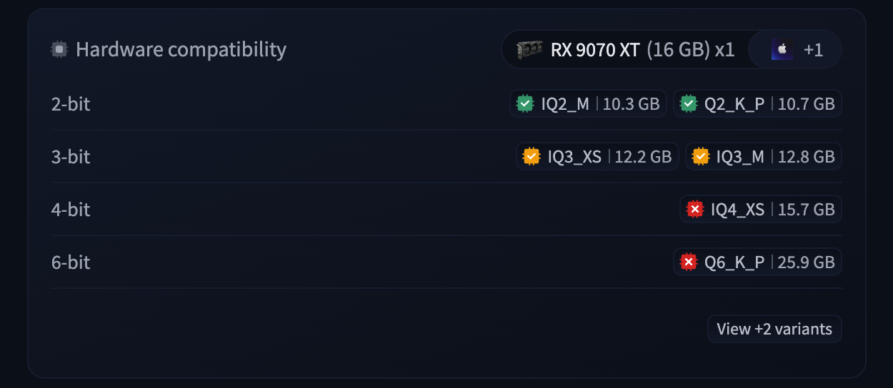
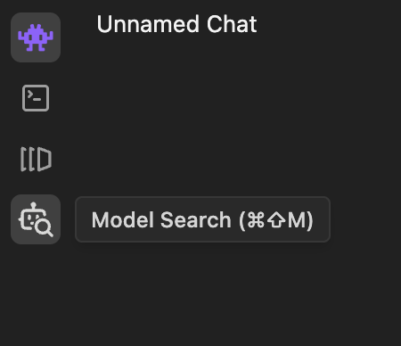
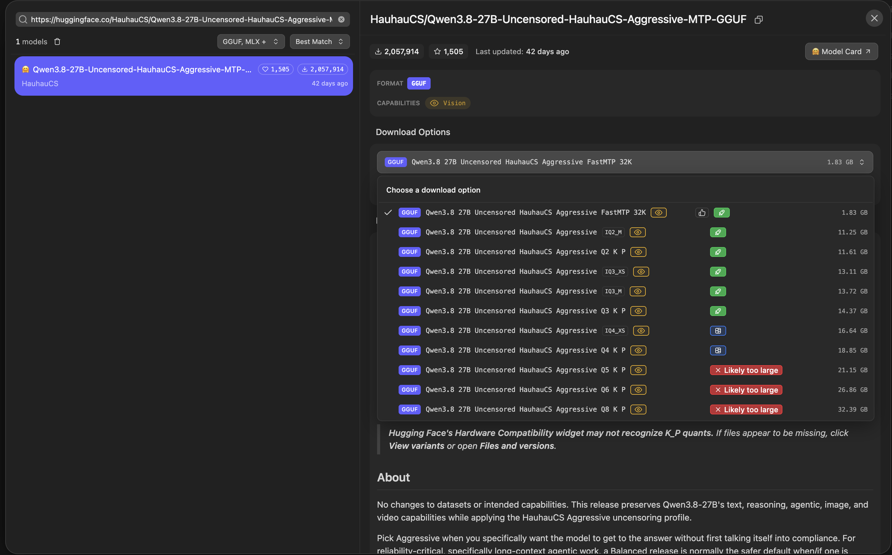
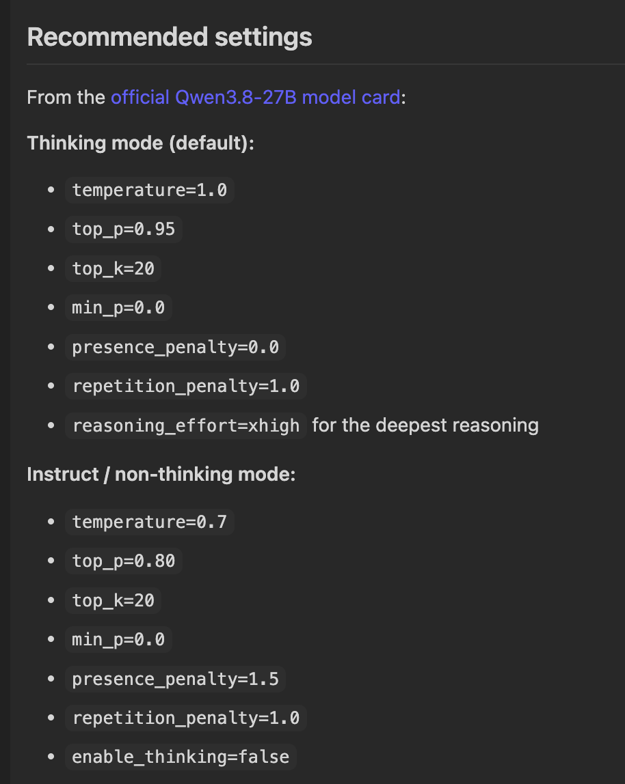
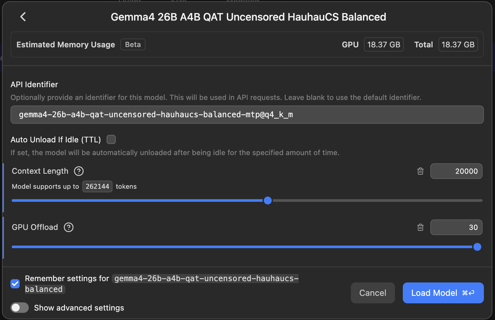

+++
title = "How to Run a Local LLM"
date = "2026-09-24T13:50:42+02:00"
+++

<!-- markdownlint-disable-file MD029 -->

When GPT-3.5 Turbo dropped, we all tried asking it how to make meth and got an answer we didn't want, unless we jailbroke it.

Well, this isn't a problem nowadays, since local LLMs can be uncensored.
All you need is some memory.
You can run pretty bad models right on your phone or pretty good ones on your PC.

Memory is your biggest constraint, since it determines how **big/smart** your model can be.
Model size is measured in parameters, so you'll see something like 27B right after the model name.
Note that proprietary models such as GPT or Claude don't disclose their size, but you can always search for estimates.

Now a bit of theory so you know what model size to pick.

As I said, model size is measured in billions of parameters, but you won't fit a model in your memory just like that.
You have to use a **quantized version**.
Quantization is basically model compression.
After training, the model weights are 16 bits wide, and that's just too big.
It's the largest uncompressed version, and that precision takes up too much memory, so we have to use a quantized version.
I usually go for 3-bit or 4-bit quantization, since that gives the best model performance for the memory used, imo.
Ofc, if you're going to use a very small model and have a lot of headroom, you can go for the 8-bit version.
The drop in model performance from 16-bit to 8-bit is basically nonexistent.

| Quantization | Approx. bits / weight | Size vs FP16 | 8B model size | Speed vs FP16 | Quality vs FP16 | Recommended use                    |
| ------------ | --------------------: | -----------: | ------------: | ------------: | --------------- | ---------------------------------- |
| FP16 / BF16  |                16-bit |         100% |        ~16 GB |          1.0x | ~100%           | Maximum quality, powerful GPUs     |
| Q8           |                ~8-bit |         ~53% |       ~8.5 GB |     ~1.1-1.3x | ~99-100%        | Near-lossless local inference      |
| Q6           |                ~6-bit |         ~41% |       ~6.5 GB |     ~1.2-1.5x | ~98-99%         | High quality with lower memory use |
| Q5           |                ~5-bit |         ~35% |     ~5.5-6 GB |     ~1.3-1.7x | ~97-99%         | Strong quality/size compromise     |
| Q4           |                ~4-bit |         ~30% |     ~4.5-5 GB |     ~1.4-2.0x | ~95-98%         | Best general-purpose choice        |
| Q3           |                ~3-bit |         ~24% |     ~3.5-4 GB |     ~1.4-2.1x | ~90-96%         | Limited RAM/VRAM                   |
| Q2           |                ~2-bit |         ~19% |         ~3 GB |     ~1.2-2.0x | ~80-90%         | Extreme memory constraints         |

While researching, I actually found that 2-bit quantization can be a bit slower than higher-bit quantization because your hardware needs to convert the weights to 4-bit values to do math on them.

But there's a bit more to quantization.
When quantizing a model, different weights can use different precisions.
You don't really need to know the details, but here's a table of the quantization options.
These are useful for minmaxxing when you want to fit the best model into limited memory.

| Quantization |   Effective BPW |  8B size | Example speed | Quality            | Recommended use                                             |
| ------------ | --------------: | -------: | ------------: | ------------------ | ----------------------------------------------------------- |
| F32          |          32-bit |   ~30 GB |           Low | Maximum            | Training/debugging, almost never useful for local inference |
| FP16 / BF16  |           ~16.0 |   ~15 GB |      29 tok/s | Maximum            | Maximum quality                                             |
| Q8_0         |           ~8.50 | ~7.95 GB |      51 tok/s | Virtually lossless | High quality when memory is plentiful                       |
| Q6_K         |           ~6.56 | ~6.14 GB |      59 tok/s | Virtually lossless | Excellent quality, modest compression                       |
| Q5_K_M       |           ~5.70 | ~5.33 GB |      67 tok/s | Excellent          | High-quality local inference                                |
| Q5_K_S       |           ~5.57 | ~5.21 GB |      70 tok/s | Excellent          | Slightly smaller Q5                                         |
| Q5_1         |            ~5.5 | ~5.65 GB |        Varies | Excellent          | Older quantization format                                   |
| Q5_0         |            ~5.0 | ~5.21 GB |        Varies | Very high          | Older quantization format                                   |
| Q4_K_M       |           ~4.89 | ~4.58 GB |      72 tok/s | Very high          | Best general-purpose choice                                 |
| Q4_K_S       |           ~4.67 | ~4.36 GB |      77 tok/s | Very high          | Smaller alternative to Q4_K_M                               |
| IQ4_NL       |           ~4.68 | ~4.38 GB |      77 tok/s | Very high          | Non-linear 4-bit quantization                               |
| IQ4_XS       |           ~4.46 | ~4.17 GB |      78 tok/s | Very high          | Smaller I-quant alternative                                 |
| Q4_1         |            ~4.5 | ~4.78 GB |        Varies | High               | Older quantization format                                   |
| Q4_0         |            ~4.5 | ~4.34 GB |        Varies | High               | Older, widely supported format                              |
| Q3_K_L       |           ~4.30 | ~4.02 GB |      69 tok/s | High               | Largest Q3 K-quant                                          |
| Q3_K_M       |           ~4.00 | ~3.74 GB |      72 tok/s | Good               | Medium Q3 K-quant                                           |
| IQ3_M        |           ~3.76 | ~3.52 GB |      70 tok/s | Good               | High-quality 3-bit I-quant                                  |
| IQ3_S        |           ~3.66 | ~3.42 GB |      69 tok/s | Good               | Smaller 3-bit I-quant                                       |
| Q3_K_S       |           ~3.64 | ~3.41 GB |      70 tok/s | Moderate-good      | Small Q3 K-quant                                            |
| IQ3_XS       |           ~3.50 | ~3.27 GB |      72 tok/s | Moderate-good      | Very compact 3-bit quant                                    |
| IQ3_XXS      |           ~3.25 | ~3.04 GB |      74 tok/s | Moderate           | Extreme 3-bit compression                                   |
| Q2_K         |           ~3.16 | ~2.95 GB |      80 tok/s | Moderate-low       | Very limited RAM/VRAM                                       |
| Q2_K_S       |           ~2.97 | ~2.78 GB |      90 tok/s | Low-moderate       | Smaller Q2 K-quant                                          |
| IQ2_M        |           ~2.93 | ~2.74 GB |      74 tok/s | Low-moderate       | Best quality among IQ2 variants                             |
| IQ2_S        |           ~2.74 | ~2.56 GB |      77 tok/s | Low                | Severe memory constraints                                   |
| IQ2_XS       |           ~2.59 | ~2.42 GB |      78 tok/s | Low                | Very small model size                                       |
| IQ2_XXS      |           ~2.38 | ~2.23 GB |      80 tok/s | Very low           | Extreme compression                                         |
| Q2_0         |           ~2.25 |    ~2 GB |        Varies | Very low           | Experimental/extreme compression                            |
| TQ2_0        |       ~2.06 raw |    ~2 GB |        Varies | Very low           | Ternary quantization                                        |
| IQ1_M        | ~2.15 effective | ~2.01 GB |      73 tok/s | Extremely low      | Only when memory is the priority                            |
| IQ1_S        | ~2.00 effective | ~1.87 GB |      80 tok/s | Extremely low      | Extreme memory constraints                                  |
| TQ1_0        |       ~1.69 raw |  ~1.6 GB |        Varies | Extremely low      | Ternary quantization                                        |
| Q1_0         |       ~1.13 raw |  ~1.1 GB |        Varies | Experimental       | Maximum compression                                         |

The main thing to know is that quantizations with an `I` prefix, like `IQ4_XS`, are _smartly_ compressed, so they take up less space but are a bit slower.

That's about it for the theory.
Now let's run the model.

1. [Download LM Studio](https://lmstudio.ai/download).
1. Find your favorite model.
   At the time of writing, my favorite local model is [Qwen3.8-27B](https://huggingface.co/HauhauCS/Qwen3.8-27B-Uncensored-HauhauCS-Aggressive-MTP-GGUF).
   The 3-bit variant should fit in 16 GB of memory.
   I also recommend [HauhauCS](https://huggingface.co/HauhauCS) for uncensored versions of models.
   Also, don't ask LLMs for model recommendations, since new models come out so quickly that they'll recommend an old one.

3. Download this model directly inside LM Studio instead of from the Hugging Face website.

4. Pick a quantization.
   For 16 GB of memory, pick `Q3_K_P`.
1. Configure the inference options according to the model card.
   This is optional, but recommended.
   These are the settings for Qwen3.8-27B:

6. Set `GPU Offload` to max and choose a `Context Length`.
   Context length is how much text the model can work with at once, measured in tokens.
   I recommend starting with something like `10_000`.
   You can always increase it later.
   Also, watch your VRAM and RAM usage and experiment to see how much spilling into RAM slows down the model.
   You can turn on the tokens-per-second label in the settings.
   I usually aim for at least 30 tokens per second.

Now that you've got your model running, I'll explain one more thing.
Models can be either `Dense` or `MoE`.
The rough idea is that in dense models, each token goes through all of the parameters.
Qwen3.8-27B is a dense model, so every token goes through each of its 27B parameters.
MoE stands for mixture of experts, and it's a bit more complex.
It uses experts, and only some of them are active for each token.
For example, Qwen3.6-35B-A3B has 35B parameters and 3B active parameters.
That means each token uses only 3B of the 35B parameters, making it a lot faster.
ChatGPT, Claude, and all of the big ones are MoE.
